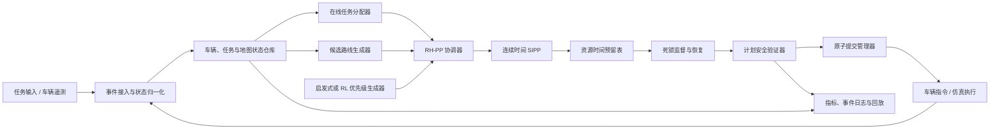
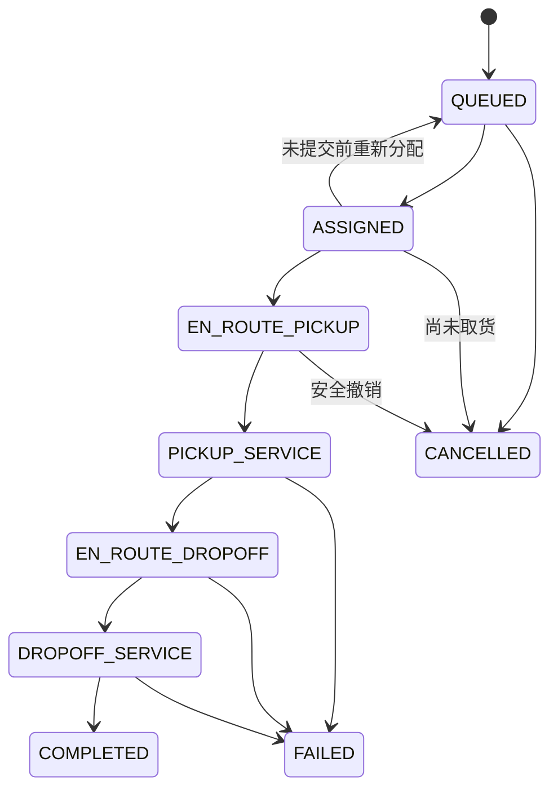
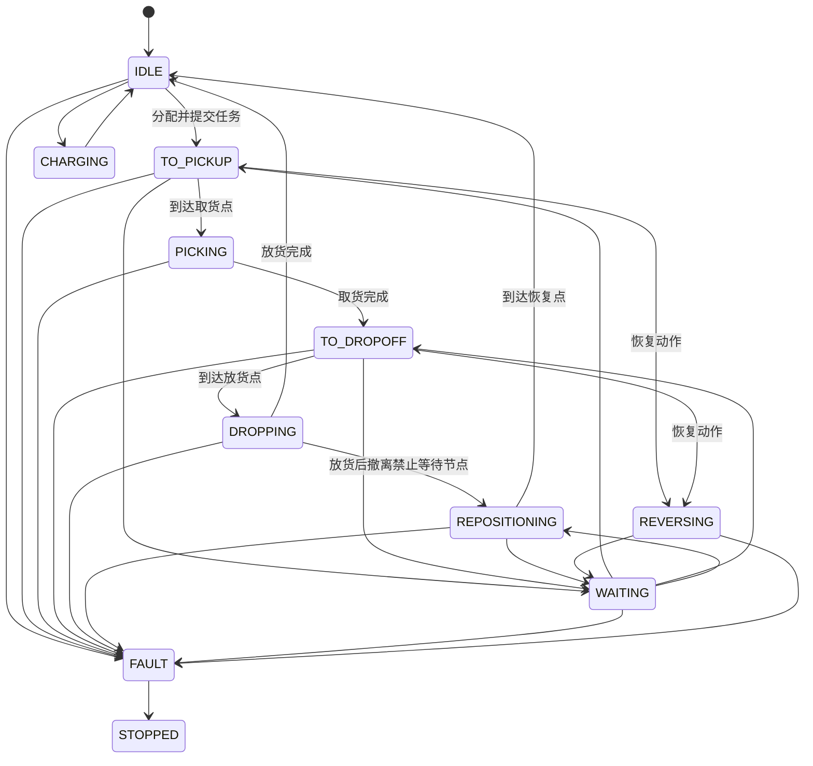

# MASP 持续任务多车调度系统设计

文档状态：Draft v1.0

最后更新：2026-08-06

适用仓库：`E:\project\MASP`

目标读者：调度算法、仿真、后端、测试与现场集成工程师

## 1. 文档目的

本文档定义 MASP 持续任务多车调度系统的完整设计基线，用于指导后续代码结构、算法实现、接口联调、仿真实验和验收。

系统面向具有持续取货/放货任务输入的仓储车辆集群。车辆需要从当前起点前往取货点，完成取货后载货前往放货点，在整个过程中避免车辆碰撞，处理窄路会车和循环等待，并以单位时间内完成的放货任务数最大化为首要优化目标。

本文档基于当前仓库已有地图资产，并参考 Zheng et al. 2026 年提出的 RL-RH-PP 架构。参考方法中的强化学习仅用于生成车辆优先级，确定性路径规划器仍负责生成和验证无碰撞计划。本系统沿用这一分层思想，但不会直接采用其固定栅格、同构车辆和单位时间模型。

## 2. 当前仓库基线

当前仓库已经提供静态地图建模能力，不包含运行时调度器或仿真器。

主要输入和产物如下：

| 文件 | 作用 |
|---|---|
| `generated/xiate-fork-map-model.json` | fork 车型有向路网 |
| `generated/xiate-jack-map-model.json` | jack 车型有向路网 |
| `generated/xiate-unified-map-model.json` | 两类车型统一物理节点和车型专属边 |
| `generated/xiate-conflict-resources.json` | 节点、边和边扫掠区域冲突资源 |
| `config/robot-profiles.json` | 车型尺寸、空载/载货运动参数和临时安全参数 |
| `tools/build_map_model.py` | 从 `.smap` 生成单车型地图模型 |
| `tools/build_unified_map_model.py` | 合并 fork/jack 物理节点并匹配共享路径 |
| `tools/build_conflict_resources.py` | 根据车辆外形生成边冲突关系 |

当前统一地图的规模为：

- 552 个物理节点。
- 1204 条车型专属有向边。
- 104 个 fork/jack 共享物理节点。
- 70 对共享物理路径。
- 6266 对几何冲突边。
- fork 路网 242 个节点、380 条边，强连通。
- jack 路网 414 个节点、824 条边，强连通。

现有数据模型需要在调度实现前补齐以下内容：

- 统一节点需要保留源节点 `properties`，尤其是 AP 的 `executor`、`recfile` 和 `spin`。
- `allowWait` 不能继续硬编码为仅 PP/CP，需要改为配置策略和节点覆盖。
- 安全边距、定位误差和通信延迟目前未定，冲突资源只能作为基础几何结果。
- 原始 `.smap` 文件未纳入仓库，当前只能以生成后的 JSON 作为调度输入。

## 3. 目标与非目标

### 3.1 系统目标

1. 接收持续到达的取货/放货任务，而不是一次性静态任务集合。
2. 支持可配置数量的 fork 和 jack 车辆。
3. 根据车型、载荷、作业点能力和当前拥堵进行任务分配。
4. 在有向贝塞尔路网上生成带时间的车辆路径。
5. 避免同节点、同边、对向边、交叉边和共享物理区域碰撞。
6. 在窄路、会车和循环资源等待场景中预防、检测并恢复死锁。
7. 支持按配置允许 LM/AP 计划停车。
8. 支持按配置允许预定义倒向边或受控倒退恢复。
9. 最大化完成放货任务吞吐量，并记录完整的次级运行指标。
10. 支持确定性回放、批量仿真和 RL 训练。
11. 保证 RL 或启发式策略无法绕过确定性安全验证。

### 3.2 非目标

首版不承担以下职责：

- 车辆底盘控制、轨迹跟踪、急停和现场安全 PLC 功能。
- SLAM、定位、障碍物感知和动态人车混行避障。
- 电池充电调度；CP 节点暂作为合法停车资源保留。
- 多托盘容量、任务拆单和多车协作搬运。
- 在线修改地图拓扑。
- 对任意地图和任意任务集合给出数学上的全局最优吞吐保证。

调度器是协调层，不是车辆最后一道功能安全边界。车辆本体的急停、避障和通信失联保护必须独立存在。

## 4. 核心术语

| 术语 | 定义 |
|---|---|
| 本地节点 | 单车型地图中的原始 LM/AP/PP/CP 节点 |
| 物理节点 | 统一地图中的 canonical node，可能对应多个车型本地节点 |
| 路径边 | 车型专属的有向贝塞尔路径 |
| 冲突资源 | 不能在重叠时间内被不兼容车辆计划同时占用的逻辑资源 |
| 计划窗口 | 每轮为车辆搜索路径的未来时间范围，对应论文中的 `w` |
| 执行窗口 | 一轮规划后允许实际下发并承诺执行的前缀，对应论文中的 `h` |
| 提交前缀 | 已原子提交、正常情况下不再改变的近期计划 |
| 安全区间 | 某节点或资源可被当前车辆占用的连续时间区间 |
| 计划等待 | 调度器主动安排的停车，受 LM/AP 等待策略约束 |
| 应急停车 | 车辆或安全系统为避免风险而停车，不受计划等待策略限制 |
| 地图倒向边 | 地图中 `motionDirection=1` 的预定义行驶边 |
| 动态倒退 | 调度器为恢复死锁而临时安排的反向运动，与地图倒向边不同 |
| 任务完成 | 放货服务完成，而不是仅到达取货点或放货点 |

## 5. 需求规格

### 5.1 功能需求

| 编号 | 需求 |
|---|---|
| FR-001 | 系统必须接受带释放时间的持续任务输入 |
| FR-002 | 每个任务必须包含取货、取货服务、载货运输、放货服务四个阶段 |
| FR-003 | 任务只能分配给满足车型、载荷和作业点能力约束的车辆 |
| FR-004 | 车辆数量和车型构成必须由配置定义 |
| FR-005 | 系统必须支持空载和载货运动参数以及路径级限速 |
| FR-006 | 系统必须为每个下发动作生成可验证的资源时间预留 |
| FR-007 | 任意已提交计划不得包含资源时间重叠冲突 |
| FR-008 | 系统必须在提交前检测等待依赖环和窄路无出口进入 |
| FR-009 | 系统必须支持 LM/AP 计划等待的全局配置及节点级覆盖 |
| FR-010 | 系统必须支持倒退关闭、仅地图倒向边、仅恢复倒退和计划倒退四种模式 |
| FR-011 | 车辆偏离计划、任务取消、故障和通信超时必须触发重规划或安全降级 |
| FR-012 | 系统必须输出吞吐、任务周期、车辆利用率、等待和死锁相关指标 |
| FR-013 | 相同地图、配置、任务流和随机种子必须可确定性回放 |
| FR-014 | 系统必须允许启发式优先级和 RL 优先级使用同一规划与评测接口 |

### 5.2 非功能需求

| 编号 | 需求 |
|---|---|
| NFR-001 | 安全约束优先于吞吐优化，不能通过罚分软化 |
| NFR-002 | 规划状态必须由单一逻辑所有者提交，避免并发写入预留表 |
| NFR-003 | 所有计划、任务和车辆状态必须带版本号，拒绝过期提交 |
| NFR-004 | 规划算法必须可在仿真模式和实时服务模式下复用 |
| NFR-005 | 性能优化不能改变安全校验器结果 |
| NFR-006 | 算法、配置、模型和随机种子必须记录到每次实验清单中 |
| NFR-007 | 首版至少支持 100 辆车；更大规模通过基准测试确定优化方向 |
| NFR-008 | 规划延迟的 p95 必须小于配置的规划周期，否则进入降级策略 |

## 6. 总体架构



### 6.1 分层职责

1. **静态地图层**：加载统一地图、车型配置和冲突资源，建立只读索引。
2. **领域状态层**：持有任务、车辆、作业点容量和当前计划版本。
3. **分配层**：决定任务与车辆的绑定，不直接生成底层运动计划。
4. **路径层**：生成车型可行的空间候选路线和旅行时间估计。
5. **协调层**：根据优先级顺序逐车调用 SIPP，构造滚动时间计划。
6. **交通安全层**：维护预留、检查资源冲突、等待依赖环和恢复动作。
7. **执行层**：向仿真器或真实车辆下发已提交前缀，处理反馈和偏差。
8. **学习层**：只生成候选优先级，不拥有资源写权限，也不能跳过验证器。

### 6.2 安全边界

以下组件属于确定性安全边界：

- 地图与资源校验器。
- SIPP 和预留表。
- 计划安全验证器。
- 死锁预检查。
- 原子提交管理器。
- 计划偏差和通信超时处理。

RL、随机采样和任务评分均在安全边界之外。它们可以影响候选顺序和候选任务，但不能直接产生未经验证的执行指令。

## 7. 静态地图设计

### 7.1 节点模型

统一节点建议扩展为：

```text
MapNode
  id: string
  type: LM | AP | PP | CP
  x, y: decimal meters
  allowedRobotGroups: set[RobotGroup]
  aliases: map[RobotGroup, LocalNodeId]
  positions: map[RobotGroup, Point]
  headings: map[RobotGroup, radians]
  propertiesByGroup: map[RobotGroup, map[string, value]]
  waitPolicyByGroup: map[RobotGroup, WaitPolicy]
  capacity: int
  serviceCapabilities: set[string]
  resourceIds: set[ResourceId]
```

节点合并时必须保留每个车型的属性，不能只保留第一个节点的类型。若共享节点在不同车型地图中的类型或作业属性不一致，加载时必须报出显式警告，并由配置给出最终解释。

### 7.2 边模型

```text
MapEdge
  id: string
  robotGroup: RobotGroup
  start, end: NodeId
  bezier: p0, p1, p2, p3
  lengthMeters: decimal
  motionDirection: forward | map_reverse
  moveStyle: enum
  maxSpeedMps: optional decimal
  loadedMaxSpeedMps: optional decimal
  allowedLoadStates: set[LoadState]
  ownResourceId: ResourceId
  conflictResourceIds: set[ResourceId]
  zoneResourceIds: set[ResourceId]
  dynamicReverseAllowed: bool
```

车型仍只能走自己的边。共享物理节点或路径表示资源冲突，不表示 fork 可以转入 jack 专属边，反之亦然。

### 7.3 资源类型

| 资源类型 | 示例 | 基线占用规则 |
|---|---|---|
| 节点资源 | `node:shared:LM165` | 到达、等待、转向和服务期间占用 |
| 边自有资源 | `edge:fork:edge-0` | 整个边 traversal 期间独占 |
| 边冲突资源 | `edge-conflict:42` | 两条扫掠区域相交的边不能重叠占用 |
| 作业点资源 | `station:AP1113` | 取货/放货服务期间按容量占用 |
| 窄路区域资源 | `zone:corridor-7` | 进入至完全退出期间占用 |
| 恢复区域资源 | `recovery:bay-2` | 倒退和让行动作期间占用 |

基线采用整边互斥，优点是正确性清晰；缺点是同向跟车也无法同时进入长边，可能降低吞吐。只有在基线验证稳定后，才允许把长边切分为区段或引入同向最小车头时距。

### 7.4 地图加载校验

启动时必须执行：

1. 节点和边 ID 唯一性检查。
2. 所有边端点存在性检查。
3. 每条边车型与端点车型兼容性检查。
4. 正长度、有限坐标和合法速度检查。
5. 每个冲突资源必须恰好引用有效边。
6. 每个任务候选 AP 对所需车型可达性检查。
7. 每种车型的可达分量检查。
8. 节点等待策略与节点容量检查。
9. 倒退恢复点和窄路区域入口/出口检查。
10. 地图、车型配置和冲突资源版本一致性检查。

任何会破坏安全正确性的错误必须阻止系统启动；仅影响性能或显示的异常可以警告后继续。

## 8. 领域模型

### 8.1 任务模型

首版任务为不可拆分的单车取放货任务：

```text
TransportTask
  id: string
  revision: integer
  releaseTimeMs: int64
  pickupNodeId: NodeId
  dropoffNodeId: NodeId
  requiredRobotGroup: optional RobotGroup
  payloadType: string
  payloadId: optional string
  pickupServiceMs: int64
  dropoffServiceMs: int64
  priorityClass: integer
  dueTimeMs: optional int64
  state: TaskState
  assignedVehicleId: optional VehicleId
  assignedAtMs: optional int64
  pickedAtMs: optional int64
  completedAtMs: optional int64
  failureReason: optional string
```

任务状态机：



约束：

- 同一任务同一时刻最多绑定一辆车。
- 取货完成后，任务不能自动退回公共队列；必须继续由当前车辆送达，或进入人工异常处理。
- `COMPLETED` 只在放货服务完成后产生。
- 任务取消不能撤销已经下发的安全提交前缀；系统先安全停靠，再释放未来预留。

### 8.2 车辆模型

```text
Vehicle
  id: string
  revision: integer
  robotGroup: fork | jack
  capabilities: set[string]
  state: VehicleState
  currentNodeId: optional NodeId
  currentEdgeId: optional EdgeId
  edgeProgress: optional decimal [0, 1]
  headingRad: decimal
  loadState: empty | loaded
  payloadId: optional string
  activeTaskId: optional TaskId
  queuedTaskIds: list[TaskId]
  planId: optional PlanId
  planRevision: optional integer
  committedUntilMs: int64
  lastTelemetryMs: int64
  availableAtMs: int64
  faultCode: optional string
```

车辆状态机：



### 8.3 作业点模型

AP 需要独立于节点几何定义作业能力：

```text
Workstation
  id: string
  nodeId: NodeId
  capabilities: set[pickup, dropoff, payloadType...]
  allowedRobotGroups: set[RobotGroup]
  capacity: int
  defaultPickupServiceMs: int64
  defaultDropoffServiceMs: int64
  queuePolicy: fifo | priority
  blocksTransitDuringService: bool
```

若 AP 作业期间阻断路网，则服务预留必须同时占用作业点资源和节点资源。若站位与通行路径物理分离，可只占用作业点资源，但必须由地图配置明确声明。

## 9. 时间与运动模型

### 9.1 时间表示

- 内部时间统一使用整数毫秒 `int64`。
- 仿真可使用固定事件粒度，例如 100 ms，但资源预留仍保存毫秒区间。
- 区间统一采用半开形式 `[startMs, endMs)`，避免相邻预留边界歧义。
- 所有外部时间在接入层转换为调度器单调时间。
- 墙上时间只用于日志，不用于排序和安全判断。

### 9.2 边通行时间

边通行速度取以下最小值：

```text
effectiveMaxSpeed = min(
  vehicleProfileSpeed(loadState, motionDirection),
  edgeSpeedOverride(loadState),
  curvatureSpeedLimit,
  temporaryTrafficLimit
)
```

通行时间至少包括：

- 沿边长度的加速、匀速和减速时间。
- 起点和终点方向变化所需旋转时间。
- 载货状态对应的加速度和旋转约束。
- 调度安全缓冲。

若边长足够达到最高速度，使用梯形速度曲线；否则使用三角速度曲线。首版允许在每条边入口假设安全可停速度，在后续版本再连续传播入边速度。所有估计必须向上取整到调度时间粒度，不能低估占用时间。

### 9.3 安全缓冲

当前固定 `footprintMargin=0` 不足以用于真实运行。安全占用至少考虑：

```text
longitudinalBuffer >= localizationError
                    + maxSpeed * communicationLatency
                    + maxSpeed^2 / (2 * guaranteedDeceleration)
                    + fixedClearance
```

实际实现可以将空间安全量用于重新膨胀扫掠区域，也可以将一部分转换为资源进入前和退出后的时间缓冲。配置必须区分：

- 车辆外形几何边距。
- 定位误差。
- 通信/执行延迟。
- 制动距离。
- 固定保守余量。

正式连接真实车辆前，上述参数必须由车辆和安全负责人确认。

## 10. 等待与倒退策略

### 10.1 计划等待

等待策略按以下优先级解析：

1. 节点 ID 级显式覆盖。
2. 车型与节点类型组合覆盖。
3. 全局允许节点类型。
4. 默认拒绝。

建议默认配置仅允许 PP/CP 计划等待，LM/AP 由用户显式开启：

```yaml
traffic:
  wait:
    allowed_node_types: [PP, CP]
    type_overrides:
      fork:
        LM: false
        AP: false
      jack:
        LM: false
        AP: false
    node_overrides: {}
    max_planned_wait_ms: 60000
```

计划等待和应急停车必须分开：即使某节点不允许计划等待，车辆安全控制器仍可以急停。此时调度器应将其视为计划偏差，冻结相关资源并立即重规划。

### 10.2 倒退模式

| 模式 | 行为 |
|---|---|
| `disabled` | 不允许动态倒退；地图已有倒向边仍可按地图定义使用 |
| `map_edges_only` | 只能走地图中已明确标识为倒向运动的边 |
| `recovery_only` | 正常规划不用动态倒退，仅死锁恢复器可申请 |
| `planned` | 正常规划可以把动态倒退作为高成本候选动作 |

推荐初始值为 `map_edges_only`，死锁恢复验证后再开启 `recovery_only`。

动态倒退必须满足：

1. 车型和载货状态允许倒退。
2. 反向扫掠区域已经生成并通过碰撞校验。
3. 目标恢复点允许停车且有足够容量。
4. 整个倒退动作的资源一次性预留成功。
5. 同一窄路区域内不同时安排相互冲突的恢复动作。
6. 不超过最大倒退距离、次数和持续时间。
7. 真实车辆接口确认支持该动作语义。

## 11. 资源时间预留

### 11.1 预留记录

```text
Reservation
  id: string
  resourceId: ResourceId
  vehicleId: VehicleId
  planId: PlanId
  segmentId: string
  startMs: int64
  endMs: int64
  kind: transit | wait | service | turn | reverse | safety_hold
  committed: bool
  priority: integer
```

每个资源维护按开始时间排序的区间集合。查询必须支持：

- 给定区间是否空闲。
- 给定时刻之后的第一个可用区间。
- 某计划的全部预留批量插入、提交和撤销。
- 过期预留回收。
- 车辆故障时将近期预留升级为无限期安全占用。

### 11.2 边占用资源集合

车辆通过边 `e` 时必须同时预留：

```text
resources(e) = {
  edge own resource,
  all edge conflict resources,
  containing narrow-zone resources,
  destination node arrival resource
}
```

离开起点前需要确认目标节点有可用到达区间。若车辆必须在目标节点等待，还要确认该节点允许计划等待，并把节点占用延长到下一动作开始。

边与节点交界处采用保守重叠占用，不能假设车辆在一个瞬间从节点完全切换到边：

| 对象 | 占用区间约定 |
|---|---|
| 起点节点 | 从进入该节点开始，至少占用到车辆尾部完全离开节点安全区域 |
| 边及其冲突资源 | 从车辆前部进入边扫掠区域前的缓冲时刻，占用到车辆尾部离开后的缓冲时刻 |
| 目标节点 | 从车辆前部进入目标节点安全区域开始，占用到下一动作离开、服务结束或等待结束 |
| 连续过点 | 即使没有计划等待，也必须为目标节点保留非零的交界安全区间 |

同一车辆相邻动作的资源区间允许重叠；不同车辆不能利用“边结束等于节点开始”的时间边界同时抢占交界区域。具体进入、退出缓冲由安全配置给出，并统一使用半开区间计算。

### 11.3 原子提交

计划计算可以并行，但资源提交必须串行或事务化：

1. 规划器从状态仓库读取不可变快照和版本号。
2. 为候选计划生成全部临时预留。
3. 安全验证器验证计划不变量。
4. 提交管理器重新检查涉及资源和实体版本。
5. 所有区间无冲突时一次性提交。
6. 任一检查失败则全部放弃，并在新快照上重规划。

禁止先提交部分资源再等待其余资源。这是避免 hold-and-wait 死锁的核心约束。

## 12. 路径规划

### 12.1 空间候选路线

每种车型只在自己的有向子图上搜索。边基础成本为预计通行时间，而不是几何长度。候选路线生成支持：

- A* 或 Dijkstra 最短时间路线。
- 避开当前关闭边和故障占用区域。
- 对高拥堵资源增加软成本。
- 使用 Yen K-shortest paths 生成少量拓扑不同的候选路线。
- 对取货和放货两段分别生成路线，但在同一任务计划中联合评估。

启发函数必须是可采纳的时间下界；无法保证时可以退化为 Dijkstra。

### 12.2 连续时间 SIPP

SIPP 状态定义为：

```text
(nodeId, safeIntervalId, arrivalMs, heading, loadState, taskPhase)
```

展开一条边时：

1. 根据车辆、载货状态和边属性计算通行时长。
2. 从当前安全区间中寻找最早可出发时刻。
3. 查询边自有资源、全部冲突资源和区域资源的共同空闲区间。
4. 查询目标节点的可到达区间。
5. 若需要延迟出发，确认当前节点允许计划等待。
6. 生成新的到达状态并累计成本。

若当前节点不允许等待，则后继动作必须在允许的时间容差内立即开始。规划器不能通过在 LM/AP 暗中插入等待来获得可行解。

### 12.3 作业阶段规划

取货和放货服务都建模为占用区间：

```text
route to pickup
  -> reserve pickup node/station
  -> pickup service interval
  -> switch loadState to loaded
  -> route to dropoff
  -> reserve dropoff node/station
  -> dropoff service interval
  -> switch loadState to empty
```

载荷切换后，后续所有边通行时间和可行性必须使用载货参数重新计算。

## 13. 在线任务分配

### 13.1 兼容性过滤

候选车辆必须满足：

- 车型与任务要求兼容。
- 能到达取货点和放货点。
- AP 支持该车型和载荷能力。
- 车辆无故障且任务队列未满。
- 任务释放时间已经到达。
- 若车辆已载货，不允许插入另一不可兼容任务。

### 13.2 分配成本

首版使用最小费用匹配或最小费用流。建议成本为：

```text
assignmentCost =
    estimatedEmptyTravelMs
  + estimatedLoadedTravelMs
  + predictedCongestionDelayMs
  + pickupServiceMs
  + dropoffServiceMs
  + dueTimePenalty
  + reassignmentPenalty
  - taskAgeCredit
  - priorityClassCredit
```

吞吐是全局评价目标，不能简单把最近车辆分给最近任务。预计完成时间应包含资源拥堵和作业点排队。

### 13.3 分配策略

- MVP 默认每辆车只保留一个活动任务，降低耦合复杂度。
- 后续可配置一个待执行任务槽，用于提前分配下一任务。
- 未取货且未进入提交前缀的任务允许重新分配。
- 已开始前往取货点的任务默认保持粘性，除非预计收益超过重分配阈值。
- 已完成取货的任务禁止普通重分配。
- 为避免饥饿，任务等待时间必须提高分配优先级。

## 14. RH-PP 协调器

### 14.1 滚动规划参数

```text
planningHorizonMs = 未来搜索范围 w
executionHorizonMs = 每轮承诺执行范围 h
0 < executionHorizonMs <= planningHorizonMs
```

参考论文使用 `w=20`、`h=5` 个离散时间步。MASP 使用连续毫秒，需要通过车辆速度和地图尺度重新标定，而不是直接套用 20 秒和 5 秒。

执行窗口不能机械截断在道路或禁止等待节点中。实现必须从名义执行截止时刻继续延伸到下一个允许等待的 PP/CP，形成 `safeUntilMs`。若路径中没有更近的合法安全点，本轮提交边界可能覆盖整段取货、放货和撤离计划；离线仿真仍输出完整计划用于确定性回放，但真实车辆接口只能发布已经确认的安全提交前缀。

### 14.2 优先级候选

每轮生成 `K` 个车辆全序或冲突车辆子集全序：

1. 任务优先级和等待时间顺序。
2. 最短剩余处理时间顺序。
3. 当前阻塞度/拥堵度顺序。
4. 载货车辆优先顺序。
5. 上一轮顺序的小范围扰动。
6. 随机顺序，用于探索和基线。
7. RL 策略生成顺序。

固定已提交动作不参与重新排序。故障、停止或无路线车辆也不进入正常优先级排列。

### 14.3 单个顺序求解

对每个候选优先级顺序：

```text
copy committed reservations as hard constraints
for vehicle in priority_order:
    build vehicle intent for current task phase
    run time-aware SIPP
    if feasible:
        add candidate reservations as hard constraints for lower-priority vehicles
    else:
        mark candidate infeasible
        try alternate spatial route or legal waiting action
validate all resulting plans
run deadlock precheck
score candidate
```

### 14.4 候选评分

采用词典序目标，避免用小权重意外交换安全和吞吐：

1. 必须满足安全可行。
2. 必须通过死锁预检查。
3. 最大化计划窗口内预计完成的放货任务数。
4. 最大化预计完成的取货数。
5. 最小化任务逾期和排队时间。
6. 最小化总等待时间。
7. 最小化空驶时间、计划变更和倒退动作。

可以在同一词典序层内部使用加权和，但安全和死锁结果永远不能变成软罚分。

### 14.5 规划失败降级

按以下顺序降级：

1. 尝试下一优先级顺序。
2. 尝试替代空间路线。
3. 减少本轮可重规划车辆集合。
4. 在合法节点延长等待。
5. 保留上一轮仍安全的提交前缀。
6. 调用死锁恢复器生成受控倒退或让行动作。
7. 无安全方案时下发安全停止，不得输出碰撞计划。

参考 RL-RH-PP 的局部等待修复可以作为候选修复器，但不能作为死锁保证，因为其只保证局部无碰撞，不保证进展或无活锁。

## 15. 死锁预防、检测与恢复

### 15.1 死锁类型

- 对向车辆同时进入单车宽窄路。
- 多车在交叉口形成循环资源等待。
- 车辆占据目标节点，同时等待下一个被占节点。
- 作业点队列溢出并反向阻塞主路。
- 禁止等待的节点被规划成等待点。
- 低优先级车辆长期得不到资源形成饥饿。
- 计划修复反复产生相同等待状态形成活锁。

### 15.2 静态窄路区域

离线分析或人工配置单入口/低容量区域：

```text
TrafficZone
  id
  memberNodes
  memberEdges
  entryEdges
  exitEdges
  capacity
  passingAllowed
  directionalMode
  recoveryNodes
```

对不允许会车的区域，车辆进入前必须同时获得：

- 区域资源。
- 到出口的完整路径资源或可证明可到达的出口缓冲位。
- 区域外下一安全等待点的容量。

不能只预留下一个入口边后再在区域内部等待。

### 15.3 等待图

每轮提交前建立车辆等待图：

```text
A -> B
```

表示车辆 A 在提交前缀内需要的下一个关键资源由 B 占用，且 A 没有合法替代动作。若图中存在有向环，则候选计划被拒绝或送入恢复器。

等待图还用于检测饥饿：持续被其他车辆阻塞的车辆累积 `priorityAge`，并在后续优先级候选中获得提升。

### 15.4 原子前瞻预留

车辆进入窄路或不可等待区前，应原子预留直到下一个安全等待点的全部关键资源。这消除“占有入口并等待出口”的 hold-and-wait 条件，是首要死锁预防措施。

### 15.5 恢复策略

若已发生运行时死锁或计划偏差导致循环等待：

1. 冻结受影响区域的新增进入。
2. 识别等待环和所有相关车辆。
3. 优先寻找无需倒退的替代路线或释放动作。
4. 若允许恢复倒退，选择恢复代价最低的让行车辆。
5. 原子预留完整倒退路径和恢复点。
6. 只下发一个可验证的恢复序列。
7. 环解除后逐步恢复正常滚动规划。

让行车辆选择考虑：

- 是否载货。
- 距离恢复点的倒退距离。
- 任务优先级和逾期程度。
- 已等待时间。
- 倒退动作数量。
- 对其他车辆释放的资源数量。

### 15.6 保证边界

任意有向图、任意车辆初始状态和任意任务集合不可能无条件保证持续进展。系统的工程保证建立在以下前提上：

- 每个关键窄路区域存在可配置出口或恢复点。
- 车辆初始状态无碰撞。
- 调度器能阻止车辆越过未提交的资源边界。
- 遥测和执行延迟不超过安全配置。
- 允许必要的等待、重路由或恢复倒退。

在前提不满足时，系统保证安全停止和明确告警，而不是伪造“死锁已解决”。

## 16. 计划模型与执行协议

### 16.1 车辆计划

```text
VehiclePlan
  id: PlanId
  revision: integer
  vehicleId: VehicleId
  basedOnVehicleRevision: integer
  basedOnWorldRevision: integer
  createdAtMs: int64
  horizonEndMs: int64
  committedUntilMs: int64
  segments: list[PlanSegment]
```

```text
PlanSegment
  id: string
  kind: traverse | wait | pickup | dropoff | turn | reverse
  startMs, endMs: int64
  startNodeId, endNodeId: optional NodeId
  edgeId: optional EdgeId
  expectedLoadState: LoadState
  resourceIds: set[ResourceId]
  commandPayload: map
```

### 16.2 执行语义

- 车辆只能执行当前计划版本的已提交段。
- 新计划必须显式替代旧计划的未执行部分。
- 已进入边的车辆不会被瞬间改派到另一条边。
- 提交前缀只在急停、故障或确认的遥测偏差下被打断。
- 车辆确认进入和退出资源后，调度器更新实际占用时间。
- 提前到达不能直接提前进入下一资源，必须等待计划许可。
- 延迟到达会延长安全占用，并触发受影响车辆重规划。

### 16.3 遥测偏差

偏差分级：

| 级别 | 条件 | 动作 |
|---|---|---|
| 正常 | 在时间和位置容差内 | 更新预测，不重规划 |
| 轻微延迟 | 仍在已预留资源内，但可能影响后续 | 延长占用并局部重规划 |
| 路径偏差 | 进入非计划边或节点 | 冻结冲突资源，触发全局安全重规划 |
| 通信超时 | 超过遥测 TTL | 将最后已知位置及邻近资源设为安全占用 |
| 故障/急停 | 车辆报告不可移动 | 取消未来动作，保留当前区域占用并启动恢复 |

## 17. 事件驱动仿真

### 17.1 事件类型

```text
TASK_RELEASED
TASK_ASSIGNED
PLAN_COMPUTED
PLAN_COMMITTED
VEHICLE_ENTER_EDGE
VEHICLE_EXIT_EDGE
VEHICLE_WAIT_STARTED
VEHICLE_WAIT_ENDED
PICKUP_STARTED
PICKUP_COMPLETED
DROPOFF_STARTED
DROPOFF_COMPLETED
TELEMETRY_DELAYED
VEHICLE_FAULTED
DEADLOCK_RISK_DETECTED
RECOVERY_STARTED
RECOVERY_COMPLETED
REPLAN_TRIGGERED
```

### 17.2 事件顺序

同一时间戳使用固定优先级和递增序列号排序。例如：

1. 安全/故障事件。
2. 车辆离开资源或等待结束。
3. 取货/放货完成。
4. 新任务释放。
5. 任务分配。
6. 计划计算。
7. 计划提交。
8. 车辆进入资源、开始等待或开始取放货服务。
9. 指标采样。

任务释放、分配和计划提交必须排在同时间戳的动作进入之前，使第一段动作可以从计划创建时刻立即开始，同时仍能通过车辆 `revision` 校验。固定事件顺序是确定性回放的必要条件。

### 17.3 调度循环

```text
on event or planning tick:
    apply event to authoritative state
    expire completed reservations
    determine affected vehicles and tasks
    snapshot state with revision
    update compatible task assignments
    generate route intents
    generate K priority orders
    solve RH-PP candidates
    reject unsafe or cyclic-wait candidates
    select lexicographically best candidate
    atomically commit execution horizon
    publish commands
    append events and metrics
```

## 18. RL 优先级策略

### 18.1 接入时机

只有满足以下条件后才开始 RL：

- 确定性 RH-PP 基线通过全部安全测试。
- 任务流和指标可以确定性回放。
- 至少有随机、FIFO、任务年龄和拥堵启发式基线。
- 死锁监督器独立于优先级生成器运行。
- 仿真吞吐结果对配置变化稳定且可解释。

### 18.2 观察空间

不能直接沿用原论文的绝对栅格位置 embedding。建议每辆车的观察包括：

- 车型、载货状态、任务阶段和车辆状态。
- 当前节点/边的结构与几何特征。
- 未来若干路线 token：节点、边、预计到达时间、资源集合摘要。
- 任务释放时间、等待时间、优先级和 due-time slack。
- 计划窗口内的资源拥堵度和冲突车辆数量。
- 最近等待比例、重规划次数和死锁风险分数。
- 作业点队列长度。

地图特征使用可迁移的图结构特征或预训练图编码，不把固定节点 ID 直接当成跨地图语义。

### 18.3 动作空间

动作是需要重规划车辆的优先级排列。解码器必须：

- 屏蔽故障、停止和无需规划车辆。
- 每辆候选车恰好选择一次。
- 支持不同车辆数量。
- 支持一次采样 `K` 个候选排列。
- 在推理超时时退化为确定性启发式。

车辆很多但实际冲突局部时，可只排列冲突连通分量，其余车辆保持稳定顺序，降低 `O(N^2)` 注意力和全排列解码成本。

### 18.4 奖励函数

推荐奖励：

```text
r_t =
    + alpha * newlyCompletedDropoffs
    + alphaPickup * newlyCompletedPickups
    - beta * queuedTaskTimeDelta
    - gamma * totalPlannedWaitDelta
    - eta * infeasibleVehicleCount
    - rho * deadlockRiskCount
    - xi * reverseActionCount
    - zeta * excessivePlanChanges
```

其中完成放货是主正奖励。安全冲突不进入奖励函数，因为含冲突计划会在环境外层直接判无效，不能让策略通过收益权衡安全。

为减少稀疏奖励，可以增加基于预计完成时间的 potential shaping，但必须验证 shaping 不会诱导车辆只接近目标而不完成服务。

### 18.5 训练与评估

训练环境随机化：

- 任务到达率和突发程度。
- 车辆数量和 fork/jack 比例。
- 取放货服务时间。
- 初始位置。
- 边速度扰动。
- 通信和执行延迟。
- LM/AP 等待策略。
- 是否允许恢复倒退。

部署门槛：

- 在未参与训练的任务流种子上优于最佳确定性基线。
- 不能增加任何非法计划、冲突或未恢复死锁。
- p95 推理时间满足规划周期。
- 在车辆数量和任务负载变化下无明显吞吐崩溃。
- 推理失败时回退路径经过故障注入测试。

## 19. 外部接口

首版可以先提供进程内 Python 接口，实时服务化时保持以下语义。

### 19.1 任务提交

```json
{
  "taskId": "task-20260804-00001",
  "releaseTimeMs": 1785823200000,
  "pickupNodeId": "fork:AP1113",
  "dropoffNodeId": "fork:AP1216",
  "requiredRobotGroup": "fork",
  "payloadType": "pallet",
  "pickupServiceMs": 5000,
  "dropoffServiceMs": 5000,
  "priorityClass": 0,
  "dueTimeMs": null
}
```

接入层必须校验节点存在、车型兼容、取放货点能力和时间字段。重复 `taskId` 必须幂等处理。

### 19.2 车辆遥测

```json
{
  "vehicleId": "fork-001",
  "vehicleRevision": 183,
  "timestampMs": 1785823205123,
  "currentNodeId": null,
  "currentEdgeId": "fork:edge-191",
  "edgeProgress": 0.43,
  "headingRad": 3.14159,
  "loadState": "loaded",
  "activePlanId": "plan-fork-001-97",
  "activePlanRevision": 97,
  "faultCode": null
}
```

### 19.3 计划输出

计划输出包含计划版本、提交截止时间和有序动作段。接收方必须返回 ACK，并拒绝低于当前版本的计划。

### 19.4 建议服务接口

| 方法 | 路径 | 作用 |
|---|---|---|
| `POST` | `/v1/tasks` | 幂等提交任务 |
| `POST` | `/v1/tasks/{id}/cancel` | 请求取消未完成任务 |
| `POST` | `/v1/telemetry` | 上报车辆状态 |
| `GET` | `/v1/vehicles/{id}/plan` | 获取当前已提交计划 |
| `GET` | `/v1/tasks/{id}` | 查询任务状态 |
| `GET` | `/v1/metrics` | 查询运行指标 |
| `POST` | `/v1/control/replan` | 触发受控重规划 |
| `POST` | `/v1/control/pause` | 停止接受新任务并安全收敛 |

## 20. 配置设计

建议新增统一运行配置，例如 `config/scheduler.yaml`：

```yaml
mode: simulation

clock:
  simulation_tick_ms: 100
  telemetry_ttl_ms: 1000

fleet:
  fixed_during_run: true
  counts:
    fork: 6
    jack: 8
  initial_positions_file: config/initial-vehicles.json
  max_queued_tasks_per_vehicle: 1

tasks:
  default_pickup_service_ms: 5000
  default_dropoff_service_ms: 5000
  reassignment_enabled: true
  reassignment_improvement_threshold_ms: 10000

planner:
  planning_period_ms: 5000
  planning_horizon_ms: 20000
  execution_horizon_ms: 5000
  candidate_order_count: 5
  candidate_route_count: 3
  priority_strategy: heuristic
  planning_timeout_ms: 1000
  whole_edge_exclusive: true

traffic:
  wait:
    allowed_node_types: [PP, CP]
    node_overrides: {}
    max_planned_wait_ms: 60000
    short_term_only: true
  reverse:
    mode: recovery_only
    along_current_edge_allowed: true
    loaded_allowed: true
    max_distance_m: 5.0
    max_duration_ms: 15000
    action_penalty_ms: 30000
  deadlock:
    wait_graph_enabled: true
    atomic_zone_reservation: true
    starvation_age_step_ms: 5000
    recovery_timeout_ms: 30000

safety:
  footprint_margin_m: null
  localization_error_m: null
  communication_latency_ms: null
  fixed_clearance_m: null
  guaranteed_deceleration_mps2: null
  reservation_entry_buffer_ms: null
  reservation_exit_buffer_ms: null
  provisional: true

rl:
  enabled: false
  checkpoint: null
  inference_timeout_ms: 100
  fallback_strategy: congestion_heuristic

simulation:
  seed: 0
  end_time_ms: 3600000
  task_stream_file: scenarios/default/tasks.jsonl
  event_log_file: runs/current/events.jsonl
```

安全参数为 `null` 时只能运行仿真，禁止进入真实车辆模式。

## 21. 建议代码结构

```text
masp/
  domain/
    models.py
    task_state.py
    vehicle_state.py
  map/
    loader.py
    indexes.py
    validation.py
    travel_time.py
  dispatch/
    assignment.py
    compatibility.py
    priorities.py
  planning/
    route_search.py
    safe_intervals.py
    sipp.py
    rhpp.py
    plan_score.py
  traffic/
    reservations.py
    zones.py
    deadlock.py
    recovery.py
    validator.py
  execution/
    commit.py
    commands.py
    telemetry.py
  simulation/
    engine.py
    events.py
    task_stream.py
  rl/
    env.py
    observation.py
    policy.py
    training.py
  metrics/
    collector.py
    report.py
  api/
    service.py
  config.py
  cli.py
tests/
  unit/
  property/
  scenarios/
  performance/
scenarios/
config/
generated/
```

建议先用 Python 建立可验证参考实现，通过接口隔离 `PlannerBackend`。只有性能分析确认 SIPP、Top-K 或预留查询成为瓶颈后，再将热点迁移到 C++/Rust，并保持相同测试向量。

### 21.1 内部模块契约

核心模块建议通过窄接口协作：

```text
TaskAllocator.assign(worldSnapshot, queuedTasks) -> AssignmentProposal

RouteProvider.routes(vehicle, taskPhase, mapSnapshot, limit) -> list[SpatialRoute]

PriorityPolicy.generate(planningContext, countK) -> list[PriorityOrder]

PlannerBackend.plan(vehicleIntent, hardReservations, planningHorizon) -> PlanResult

DeadlockSupervisor.evaluate(candidatePlans, reservationSnapshot) -> DeadlockDecision

PlanValidator.validate(candidatePlans, worldSnapshot) -> ValidationReport

CommitManager.commit(candidateBundle, expectedVersions) -> CommitResult
```

接口规则：

- 输入均为不可变快照或值对象。
- `TaskAllocator`、`PriorityPolicy` 和 `PlannerBackend` 不得直接写权威状态。
- `PlanResult` 必须同时返回路径段、资源需求和失败原因。
- `ValidationReport` 必须包含机器可判定错误码，不能只返回日志文本。
- 只有 `CommitManager` 可以写入已提交预留和活动计划。
- Python 与未来原生后端必须实现相同的 `PlannerBackend` 语义。

### 21.2 依赖边界

- `shapely` 继续用于离线几何和冲突资源生成，不进入每次实时路径搜索的热循环。
- 任务匹配首版可使用成熟的最小费用匹配/流实现，外部求解器结果仍需领域层验证。
- PyTorch 只由 `rl/` 引用，关闭 RL 时核心调度器不应加载 GPU 依赖。
- API 框架、持久化和监控库不能渗透到规划领域模型。
- 原生扩展只能作为可替换计算后端，不拥有权威状态或文件格式解释权。

## 22. 并发与一致性

### 22.1 单写者模型

权威状态由单一调度事件循环写入。任务接入、遥测和规划结果都转换为事件排队处理。规划计算可以在工作线程并行，但只能读取不可变快照。

### 22.2 乐观提交

每个规划结果记录：

- 世界状态版本。
- 车辆版本。
- 任务版本。
- 涉及资源的预留版本。

提交时任一版本变化则拒绝整个结果。不得尝试局部修补一个基于过期状态的计划。

### 22.3 幂等性

- 任务提交按 `taskId` 幂等。
- 遥测按车辆 revision 和时间戳去重。
- 计划 ACK 按 `(planId, revision)` 幂等。
- 完成事件按 `(taskId, phase, eventId)` 幂等。

## 23. 安全不变量

系统在任何已提交状态下必须满足：

1. 同一互斥资源不存在不兼容的重叠普通预留；`safety_freeze` 是阻止新进入的门禁，不计作额外占用容量，可覆盖冻结时已经执行中的占用和被显式豁免的恢复车辆。
2. 同一车辆的计划段时间单调且不重叠。
3. 一辆车同一时刻最多执行一个运动或服务动作。
4. 一个任务同一时刻最多由一辆车持有。
5. 取货前车辆为空载，取货完成至放货完成期间为载货。
6. 车型只能走其允许的节点和边。
7. 计划等待只能发生在策略允许的节点。
8. 动态倒退只能发生在配置允许且完整预留成功的恢复计划中。
9. 禁止等待区的进入计划必须包含可到达安全出口。
10. 每个下发动作都属于已验证的提交前缀。
11. 过期遥测车辆的当前位置和安全邻域不能被其他计划复用。
12. RL 输出不能直接修改预留表或计划提交状态。

这些不变量应同时存在于运行时断言、属性测试和场景测试中。

## 24. 指标与可观测性

### 24.1 核心业务指标

- `completed_dropoffs_per_hour`：主吞吐指标。
- `task_cycle_time_ms`：释放到放货完成。
- `task_queue_time_ms`：释放到分配或开始执行。
- `pickup_to_dropoff_time_ms`。
- due-time 准时率和逾期时间。

### 24.2 车辆指标

- 空载行驶、载货行驶、等待、服务和故障时间比例。
- 空驶距离与载货距离。
- 每车完成任务数及公平性。
- 计划重排次数。
- 倒退次数和距离。
- 非计划停车次数。

### 24.3 调度指标

- 每轮候选顺序数量、可行数量和最终选择原因。
- SIPP 展开节点数和耗时。
- 预留冲突拒绝次数。
- 重规划成功率。
- 规划耗时 p50/p95/p99。
- 规划周期超时次数。
- 死锁风险检测、拒绝和恢复次数。
- 等待图最大环长度。
- RL 推理耗时和回退次数。

### 24.4 实验清单

每次仿真输出：

- Git commit。
- 地图和冲突资源内容哈希。
- 调度配置完整快照。
- RL checkpoint 哈希。
- 任务流文件哈希。
- 随机种子。
- 运行环境和硬件摘要。
- 事件日志和最终指标。

## 25. 测试策略

### 25.1 单元测试

- 地图与冲突资源加载。
- 空载/载货边通行时间。
- 半开时间区间插入、查询、撤销和合并。
- 节点等待策略解析。
- 任务和车辆状态机合法迁移。
- 任务兼容性过滤和分配成本。
- 等待图环检测。
- 计划版本和幂等处理。

### 25.2 属性测试

- 随机预留序列提交后不存在区间重叠。
- 任意已提交计划满足所有安全不变量。
- SIPP 输出的每个后继动作都位于共同安全区间。
- 相同输入和种子产生相同事件日志摘要。
- 取消任意未提交候选不会改变已提交预留。

### 25.3 差分测试

在小图上用穷举时间展开搜索作为 oracle，与 SIPP 对比：

- 若 SIPP 返回可行计划，穷举验证无冲突。
- 在限定时间界内，若穷举存在方案而 SIPP 无方案，记录完备性缺陷。
- 对相同优先级顺序比较 Python 和未来原生后端输出。

### 25.4 必测场景

1. 两车交叉口同时到达。
2. 同边同向跟车。
3. 同边对向进入。
4. 两车窄路会车且一端有恢复点。
5. 两车窄路会车但无合法恢复点。
6. 四车环形等待。
7. AP 服务阻断主路。
8. LM 等待关闭与开启的对照。
9. AP 等待关闭与开启的对照。
10. 动态倒退关闭、恢复模式和载货禁止的对照。
11. fork/jack 在共享物理路径相遇。
12. 任务突发输入和作业点排队。
13. 车辆执行延迟导致预留延长。
14. 通信超时和车辆故障。
15. 任务在取货前取消。
16. 任务取货后发生车辆故障。

### 25.5 性能测试

至少覆盖以下矩阵：

- 车辆数：10、20、50、80、100、150。
- 任务负载：低于容量、接近容量、超过容量。
- 候选顺序 `K`：1、5、20。
- 计划窗口和执行窗口多组组合。
- 整边互斥与边区段化对照。
- 启发式与 RL 优先级对照。

每个配置使用多个随机种子，报告均值、标准差和置信区间，不能只展示最佳单次运行。

## 26. 验收标准

### 26.1 功能和安全验收

- 所有必测场景中资源冲突数为 0。
- 非法 LM/AP 计划等待数为 0。
- 非法倒退动作数为 0。
- 任务重复分配和载荷状态错误数为 0。
- 已知等待环在提交前被拒绝，或按配置进入恢复/安全停止。
- 通信超时后不会把车辆最后占用区域分配给其他车辆。
- 任务流可完整回放且结果摘要一致。

### 26.2 性能验收

初始目标建议为：

- 100 辆车、`K=5` 时规划延迟 p95 不超过配置的规划周期。
- 稳态运行不持续积累过期规划请求。
- 启用拥堵感知 RH-PP 后，吞吐不低于随机优先级 RH-PP。
- RL 只有在独立测试集吞吐显著优于最佳确定性基线时才允许启用。
- 任何吞吐提升不能伴随安全不变量违例增加。

具体实时 SLA 需要在目标部署硬件确定后冻结。

## 27. 实施阶段

### 阶段 0：模型修正与决策冻结

交付物：

- 保留 AP 属性的统一地图模型。
- 可配置等待策略。
- 安全参数占位和真实模式启动保护。
- 作业点、窄路区和恢复点配置格式。
- 任务和车辆 JSON Schema。

退出条件：所有静态模型校验通过，关键业务问题得到确认。

实施状态（2026-08-04）：已完成。

- `generated/xiate-unified-map-model.json` 已保留各车型原始节点属性，并解析全局等待策略。
- `generated/xiate-workstations.json` 已覆盖全部 133 个 AP，取放货服务默认各 5000 ms，服务期间独占节点。
- `config/scheduler.json`、`config/initial-vehicles.json` 和 `config/traffic-zones.json` 已固化阶段 0 运行配置。
- `schemas/` 已提供任务、车辆、调度器、作业点和交通区域的 JSON Schema。
- `tools/build_phase0.py` 负责一键重建和语义校验，`tools/validate_phase0.py` 负责独立 Schema 与跨文件校验。
- 当前 552 个节点、1204 条边、6266 对冲突资源、14 台初始车辆和 15 个恢复点均通过校验。
- 安全参数仍为占位值，启动保护会拒绝真实车辆模式；当前交付物仅用于仿真。

复现命令：

```powershell
python tools/build_phase0.py
python tools/validate_phase0.py
pytest -q
```

### 阶段 1：确定性仿真内核

交付物：

- 事件驱动仿真器。
- 车辆和任务状态机。
- 资源预留表。
- 确定性回放与基础指标。

退出条件：单车取放货和基础多车资源占用测试通过。

实施状态（2026-08-05）：已完成。

- `masp/events.py` 实现按时间、事件优先级和递增序列号排序的确定性事件队列。
- `masp/domain.py` 实现任务与车辆状态机，并拒绝跳过取货、重复放货等非法迁移。
- `masp/reservations.py` 实现半开时间区间、可用区间查询、批量插入、提交、撤销和过期回收；批量冲突时不写入任何部分结果。
- `masp/plans.py` 校验边方向、车型、路径连续性、载荷、等待权限、服务时长和取放货顺序。
- `masp/simulator.py` 执行显式计划，输出事件日志、回放摘要、任务吞吐及车辆状态时间。
- `schemas/plan.schema.json` 和 `schemas/simulation-scenario.schema.json` 定义阶段 1 输入格式。
- `scenarios/phase1-single-vehicle.json` 已在实际统一地图上完成一次取货和放货，并在放货后从禁止等待的 AP 撤离到 PP；自动任务分配与找路仍属于阶段 2。
- 两车重叠占用同一冲突资源时，整个预留批次会被拒绝；采用半开区间后，前车结束时刻等于后车开始时刻可以安全交接。

复现命令：

```powershell
python tools/run_phase1.py scenarios/phase1-single-vehicle.json
pytest -q
```

### 阶段 2：任务分配与连续时间 SIPP

交付物：

- 兼容性过滤和最小费用任务分配。
- 空间候选路线。
- 连续时间 SIPP。
- 服务时间和载荷切换。

退出条件：无冲突完成持续任务流，且所有计划满足等待策略。

实施状态（2026-08-05）：已完成。

- `masp/assignment.py` 完成车型、任务状态、载荷、工位能力和可达性过滤，并使用最小费用最大流进行批量分配；某个车辆-任务组合规划失败时会排除该组合并尝试其他匹配。
- `masp/motion.py` 按空载/载货、前进/倒退、边限速、曲率、加减速和旋转约束估算通行时间，并向上取整到调度时间粒度。
- `masp/routing.py` 在对应车型的有向子图上生成 K 条候选路线。
- `masp/sipp.py` 对道路、冲突区、节点和工位求共同安全区间，只在策略允许的节点显式等待；AP 服务到达即开始，放货后自动撤离到配置的 PP/CP 恢复点。
- `masp/phase2.py` 按任务释放时间持续规划，车辆完成任务并撤离后可再次接单，旧停车尾预留与新计划使用原子替换。
- `schemas/phase2-scenario.schema.json`、`scenarios/phase2-continuous-tasks.json` 和 `tools/run_phase2.py` 提供可复现的持续任务流输入与运行入口。
- 示例中 2 辆车完成 3 个分时任务，其中 1 辆车连续执行 2 个任务；自动等待仅发生在允许等待的 PP，预留冲突为 0。
- 本阶段仍为仿真验证；RH-PP 滚动窗口、Top-K 优先级协调、吞吐基准比较属于阶段 3。

复现命令：

```powershell
python tools/run_phase2.py scenarios/phase2-continuous-tasks.json
pytest -q
```

### 阶段 3：RH-PP 与吞吐基线

交付物：

- 滚动窗口规划。
- 多种确定性和随机优先级。
- Top-K 候选求解与词典序评分。
- 吞吐和性能基准报告。

退出条件：拥堵感知基线不差于随机 RH-PP，并满足规划周期。

实施状态（2026-08-06）：已完成仿真基线。

- `masp/phase3.py` 按 `planningPeriodMs` 周期处理已释放任务，保留既有安全预留作为硬约束，并为同轮车辆生成任务年龄、最短剩余处理时间、拥堵、上一轮顺序和可复现随机顺序。
- 每个不同全序独立运行连续时间 SIPP；候选之间使用预留表副本隔离，选中后才原子替换正式预留。
- 候选按窗口内放货数、取货数、逾期、排队、等待、空驶和完成时刻进行词典序评分，安全不可行候选直接拒绝，不参与软权重交换。
- 名义 `executionHorizonMs` 会延伸到下一个允许等待节点并记录为 `safeUntilMs`。当前 LM/AP 禁止等待，因此部分车辆需要一次承诺到 PP/CP；完整遥测反馈和执行中计划修订不属于本阶段仿真入口。
- `scenarios/phase3-rh-pp-benchmark.json` 使用 3 辆车和 5 个持续任务。Top-K 完成 5/5 任务，预留冲突为 0，共评估 7 个优先级候选，其中 4 个可行。
- 拥堵基线与 3 个随机种子均达到 36 次放货/小时；拥堵基线插入等待 49,800 ms，随机基线平均 70,600 ms，因此吞吐不低于随机且等待更少。
- 本机 Top-K 规划耗时 p95 约 1.9 秒，低于 5 秒规划周期；最慢首轮约 5.9 秒，出现 1 次周期超时和 2 次超过暂定 1 秒规划超时，扩大车辆规模前仍需并行候选求解和性能优化。
- 阶段 4 的等待图、死锁环检测、窄路原子前瞻和倒退恢复尚未实现；阶段 3 不宣称具备死锁恢复保证。

复现命令：

```powershell
python tools/run_phase3.py scenarios/phase3-rh-pp-benchmark.json
pytest -q
```

### 阶段 4：死锁监督与倒退恢复

交付物：

- 窄路区域资源。
- 等待图与饥饿老化。
- 原子前瞻预留。
- 可配置恢复倒退。

退出条件：全部死锁场景可被预防、恢复或安全停止，且没有活锁。

实施状态（2026-08-06）：已完成单容量窄路区的确定性仿真 MVP。

- `masp/zones.py` 将人工配置的入口、内部边、出口和恢复点索引为互斥 `zone:<id>` 资源。当前明确只接受 `capacity=1`、`passingAllowed=false` 和 `single_direction_at_a_time`，避免用二元预留表错误模拟多容量区域。
- `masp/reservations.py` 支持带相对时间偏移的原子资源束查询并返回结构化 blocker；查询不修改正式预留表，完整批次通过后才提交。安全冻结会原子安装持久化门禁、保留冻结时已经执行中的占用，并撤销所有受影响计划在冻结时刻之后的完整预留尾部。
- `masp/sipp.py` 在车辆越过窄路入口前，一次性排程到区域出口后的下一个合法等待点。任一后续资源被占用时，整段动作统一延迟到入口外，区域内不会插入普通等待。
- `config/traffic-zones.json` 启用了真实 `jack:PP363`—`jack:PP365` 窄路。入口边本身没有共同几何冲突，但共享区域资源会阻止两辆车同时进入。
- `masp/deadlock.py` 只根据“无合法替代动作”的结构化 blocker 建立等待图，使用强连通分量检测两车或多车环，并按 `starvationAgeStepMs` 产生车辆优先级年龄；报告同时捕获预留表版本，恢复提交前若版本变化则拒绝陈旧结论。`masp/phase3.py` 的任务年龄顺序可接收该提升值。
- `masp/recovery.py` 使用独立恢复计划验证动态倒退，不复用要求完整取货/放货的运输 `PlanValidator`。恢复动作检查倒退模式、载荷许可、最大距离、最大时长、恢复点容量和完整冲突资源，然后先冻结环资源、仅豁免选中的恢复车辆，再原子替换其计划。确定性事务 ID 支持控制器重启后识别已提交决策；失败回滚使用版本比较并只撤销本次恢复事务，不盲目恢复可能已经失效的旧未来计划。
- 真实 `fork:edge-323` 用例从 99% 边进度沿原路倒退 4.76388 m 到 `fork:PP1173`；该方向没有地图反向边。两车等待环被检测后完成恢复预留，重复同一环超过阈值会转为安全停止。
- 真实四节点环 `LM1028 → LM1031 → LM2472 → LM2473 → LM1028` 的每辆车都配置了可验证的真实地图倒退候选，但最短候选均超过 5 m 上限，因此输出稳定安全停止并冻结相关节点，而不是伪造可行路径。
- `schemas/phase4-scenario.schema.json`、`scenarios/phase4-deadlock-recovery.json` 和 `tools/run_phase4.py` 提供确定性验收入口；主场景的八项检查全部通过。

复现命令：

```powershell
python tools/run_phase4.py scenarios/phase4-deadlock-recovery.json
pytest -q
```

保证边界：现有 `DeterministicSimulator` 仍是运行前装载完整运输计划的离线回放器。阶段 4 验证了独立运行时监督器、恢复计划及原子预留，但尚未实现真实车辆遥测接入、执行中运输计划撤销或向离线事件队列动态注入恢复命令；接入真实控制器前不能把本 MVP 视为生产级在线恢复闭环。

### 阶段 5：RL 优先级优化

交付物：

- Gymnasium 兼容训练环境。
- 图结构/路径 token 观察编码。
- PPO 优先级策略和 checkpoint 管理。
- 启发式、随机和 RL 的统计对照实验。

退出条件：RL 在独立场景中稳定提升吞吐，推理失败回退可靠。

### 阶段 6：实时集成与硬化

交付物：

- 实时任务和遥测接口。
- 计划 ACK、版本和幂等协议。
- 故障注入、长时间稳定性和性能测试。
- 安全参数评审和部署运行手册。

退出条件：达到目标硬件 SLA，完成现场接口和安全评审。

## 28. 关键设计决策

| 编号 | 决策 | 原因 |
|---|---|---|
| ADR-001 | 采用中心化滚动窗口调度 | 当前地图和全局吞吐目标需要全局资源视图 |
| ADR-002 | RL 只生成优先级 | 保持安全可验证并支持可靠启发式回退 |
| ADR-003 | 基线采用整边互斥 | 当前已有扫掠区域冲突，正确性优先于跟车吞吐 |
| ADR-004 | 使用整数毫秒连续时间预留 | 车辆速度、边长度和服务时间不适合单位离散步 |
| ADR-005 | 取货和放货组成一个不可拆分任务 | 防止取货后无人负责放货和载荷状态失配 |
| ADR-006 | 死锁监督独立于 RH-PP/RL | 论文修复器不保证进展或死锁消解 |
| ADR-007 | 计划计算并行、状态提交单写 | 降低延迟同时避免预留竞态 |
| ADR-008 | 默认不允许 LM/AP 计划等待 | 延续当前保守模型，通过配置显式放开 |
| ADR-009 | 默认仅使用地图预定义倒向边 | 动态倒退需要额外扫掠、车辆和现场能力验证 |
| ADR-010 | 先 Python 参考实现，再按 profiling 优化 | 先建立正确性 oracle，避免过早绑定原生后端 |

## 29. 风险与缓解

| 风险 | 影响 | 缓解措施 |
|---|---|---|
| 安全参数未知 | 冲突资源低估真实风险 | 真实模式禁止 `null` 参数；重新生成膨胀几何 |
| 整边互斥过于保守 | 吞吐偏低 | 基线稳定后按边区段或同向车头时距优化 |
| PP 不完备 | 某些顺序找不到可行解 | Top-K、替代路线、SIPP、恢复器和安全停止 |
| 任意图无法保证无死锁 | 车辆可能安全停滞 | 窄路区、出口缓冲、等待图、恢复点和倒退策略 |
| RL 奖励与吞吐错位 | 指标改善但业务吞吐不升 | 直接使用完成放货奖励并保留独立吞吐评测 |
| 绝对节点 embedding 过拟合 | 地图或规模变化失效 | 使用图结构与相对路径特征、域随机化 |
| Top-K 规划成本高 | 超过实时周期 | 冲突分量局部排序、并行候选、缓存和原生热点优化 |
| 外部任务突发超过系统容量 | 队列无限增长 | 负载告警、准入控制、优先级和容量报表 |
| 代码许可证限制 | 无法商用复用 RL-RH-PP 源码 | 法务审查；必要时只依据论文独立实现 |

## 30. 待确认业务问题

以下问题不阻塞仿真骨架开发，但会阻塞生产配置冻结：

1. fork 和 jack 的实际车辆数量范围及是否允许运行中增减。默认 fork 6台 和 jack 8台，运行中数量不变。 
2. 任务是否显式指定车型，还是根据 AP `executor` 自动推导。任务显式指定车型。
3. 取货和放货的服务时长、波动范围及作业点容量。这个先定一个预设值，方便后续业务确认。
4. AP 作业时是否阻断其所在路径节点。是。
5. 普通 LM/AP 等待是全局开关，还是需要逐节点白名单。 全局开关。
6. 允许“停车”是短时等待还是允许长期驻留。短时等待。
7. 动态倒退是否被车辆控制协议支持，载货时是否允许。是。
8. 倒退路径是否必须已有反向边，还是允许沿当前边原路退出。先允许为沿当前边原路退出。
9. 车辆初始位置、朝向和载荷如何提供。设置为可以自己定义。
10. 任务输入协议、到达率和历史回放数据格式。暂无要求。
11. 定位误差、通信延迟、制动性能和固定安全余量。暂不考虑。
12. 目标部署硬件、规划周期和最大允许决策延迟。暂无要求。
13. 真实车辆是否能严格遵循“未获得提交资源不得进入”的协议。是。
14. 电池和充电任务是否进入第一版范围。否。

## 31. 参考资料与许可证

- Han Zheng, Yining Ma, Brandon Araki, Jingkai Chen, Cathy Wu. "Learning-guided Prioritized Planning for Lifelong Multi-Agent Path Finding in Warehouse Automation." Journal of Artificial Intelligence Research, 85, 2026. DOI: `10.1613/jair.1.20611`。
- 参考实现：`https://github.com/MikeZheng777/RL-RH-PP`，审查提交 `b8cf1fb0de102a96ce843a893a531fd091c6b5cb`。
- RL-RH-PP 仓库中的 RHCR 衍生 `src/`、`inc/` 代码采用 USC Research License，商业使用需要取得许可。
- 本项目若用于商业系统，应优先考虑依据公开论文独立实现算法，并对所有第三方依赖执行许可证审查。

## 32. 需求追踪矩阵

| 需求 | 主要设计章节 | 主要验证方式 |
|---|---|---|
| FR-001、FR-002 | 8.1、12.3、17 | 持续任务流与取放货状态场景测试 |
| FR-003、FR-004 | 8.2、13、20 | 混合车型兼容性和车辆数量矩阵测试 |
| FR-005 | 7.2、9 | 通行时间单元测试和载荷切换测试 |
| FR-006、FR-007 | 11、16、23 | 预留属性测试和零冲突场景验收 |
| FR-008 | 15 | 窄路会车、四车环和无恢复点测试 |
| FR-009、FR-010 | 10、12.2 | 等待/倒退模式组合测试 |
| FR-011 | 16.3、17 | 延迟、偏航、通信超时和故障注入 |
| FR-012 | 24 | 指标完整性和实验清单测试 |
| FR-013 | 17.2、22、24.4 | 同种子事件日志摘要一致性测试 |
| FR-014 | 14、18、21.1 | 启发式/RL 后端契约与差分评测 |
| NFR-001、NFR-005 | 6.2、23 | 安全不变量和故障回退测试 |
| NFR-002、NFR-003 | 11.3、22 | 并发过期提交和版本冲突测试 |
| NFR-004、NFR-006 | 17、24.4 | 仿真/服务复用和实验复现检查 |
| NFR-007、NFR-008 | 25.5、26.2 | 100+ 车辆性能矩阵和规划延迟统计 |

## 33. 最终建议

实施路线应以确定性 `MASP-RH-PP` 为第一目标：先建立可信的连续时间仿真、资源预留、取放货任务和死锁监督，再将 RL 作为优先级优化插件接入。这样可以分别回答两个问题：

1. 在没有 RL 的情况下，系统是否安全、可执行、可回放并具备合理吞吐。
2. 在完全相同的安全边界和任务流下，RL 是否真正提高完成放货吞吐量。

只有第二个问题得到统计上稳定的肯定结果，RL 才应进入默认运行路径。
